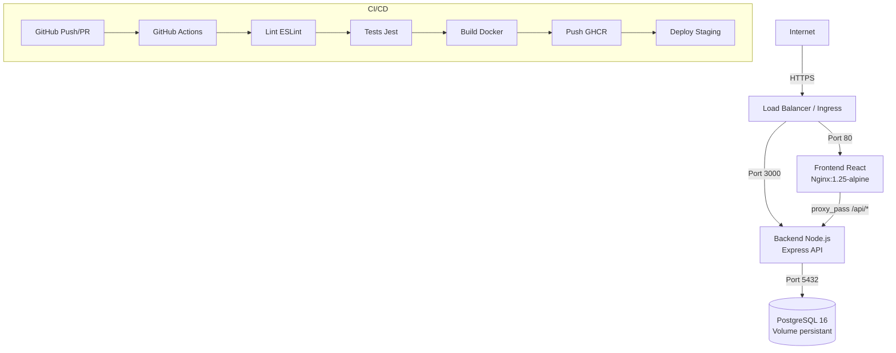

# VitalSync – Chaîne CI/CD conteneurisée

Application de suivi médical et sportif. Ce dépôt contient l'intégralité de la chaîne DevOps : conteneurisation Docker, pipeline CI/CD GitHub Actions et manifestes Kubernetes.

## Architecture



## Prérequis

| Outil | Version minimale |
|-------|-----------------|
| Docker | 24.x |
| Docker Compose | 2.x |
| Node.js | 20.x |
| Git | 2.x |

## Lancer l'application en local

```bash
# 1. Cloner le dépôt
git clone https://github.com/votre-username/vitalsync.git
cd vitalsync

# 2. Créer le fichier .env
cp .env.example .env
# Éditer .env avec vos valeurs

# 3. Démarrer tous les services
docker compose up -d --build

# 4. Vérifier que tout tourne
docker compose ps
curl http://localhost:3000/health
```

L'application est accessible sur :
- Front-end : http://localhost
- API : http://localhost:3000
- Health check : http://localhost:3000/health

## Pipeline CI/CD

La pipeline GitHub Actions comporte 3 étapes séquentielles :

1. **Lint & Tests** (`lint-and-test`) – ESLint vérifie la qualité du code, Jest exécute les tests unitaires. Si un test échoue, la pipeline s'arrête.
2. **Build & Push** (`build-and-push`) – Les images Docker sont construites et poussées vers GHCR avec un tag correspondant au SHA du commit.
3. **Deploy Staging** (`deploy-staging`) – Les services sont démarrés via docker-compose sur le runner. Un health check confirme que le back-end répond avant de valider le déploiement.

La pipeline se déclenche automatiquement sur :
- Tout push sur la branche `develop`
- Toute Pull Request vers `main`

## Choix techniques

- **Scaleway → GitHub Actions** : CI gratuite pour les dépôts publics, intégration native avec GHCR.
- **GHCR** : registry intégré à GitHub, pas besoin de compte externe.
- **Multi-stage Dockerfile** : sépare les outils de build/test de l'image de production.
- **node:20-alpine / nginx:1.25-alpine** : images minimales (~5 MB), surface d'attaque réduite.
- **Gitflow** : branches `main` (production stable), `develop` (intégration), `feature/*` (développement).

## Structure du dépôt

```
vitalsync/
├── backend/
│   ├── server.js
│   ├── package.json
│   ├── Dockerfile
│   ├── .dockerignore
│   ├── .eslintrc.js
│   └── test/
│       └── health.test.js
├── frontend/
│   ├── index.html
│   ├── nginx.conf
│   └── Dockerfile
├── k8s/
│   ├── deployment.yaml
│   ├── service.yaml
│   ├── ingress.yaml
│   └── secret.yaml
├── .github/
│   └── workflows/
│       └── ci.yml
├── docker-compose.yml
├── .gitignore
├── .env.example
└── README.md
```
